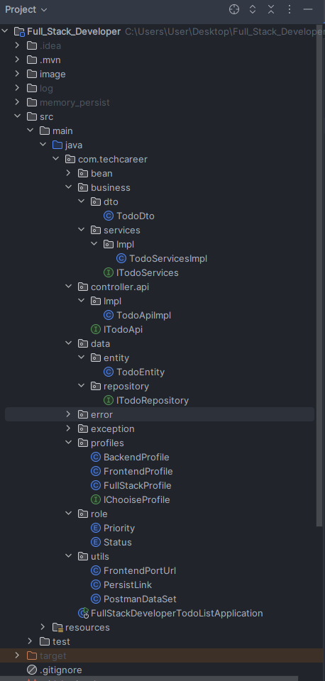
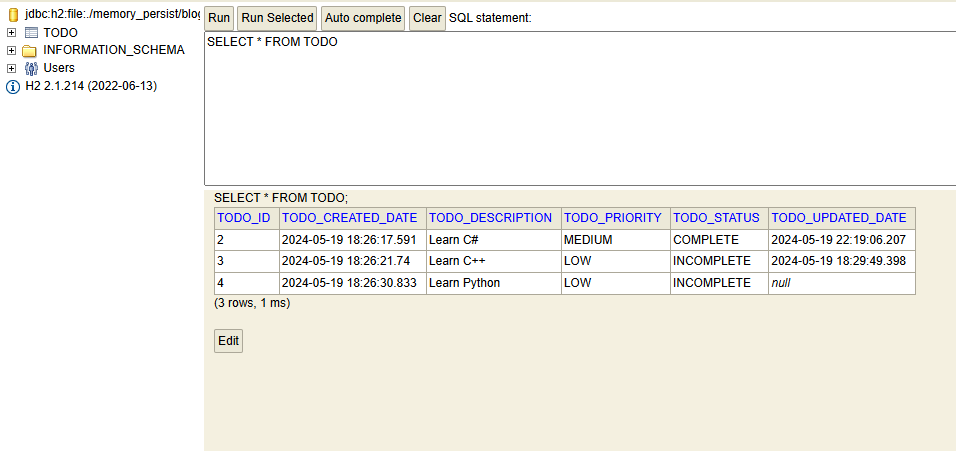
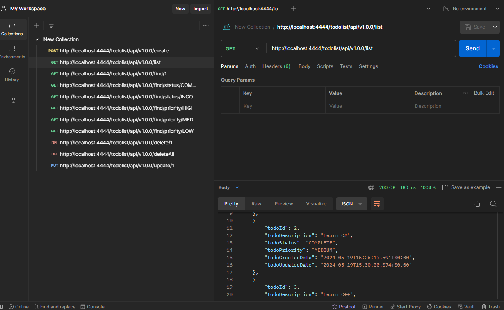
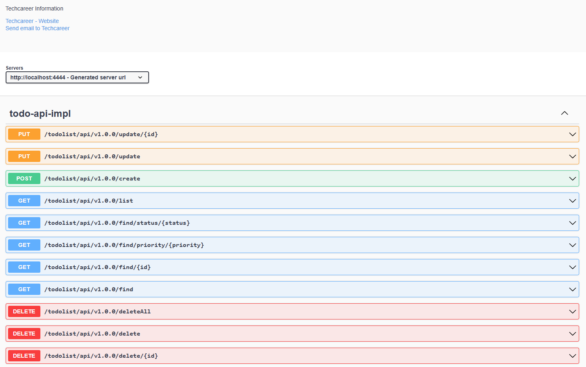
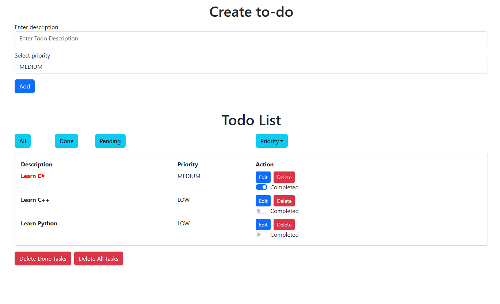

Spring Boot & React JS
---
Proje
---
Proje, Spring Boot ve React JS kullanarak bir Todo list uygulaması geliştirmeyi amaçlamaktadır. Bu uygulama, kullanıcıdan alınan verileri veritabanına kaydederek CRUD (Create, Read, Update, Delete) işlemlerini gerçekleştirecektir. Bu sayede, tam kapsamlı bir Fullstack uygulama oluşturulmuş olacaktır.

---
Project
---
The project aims to develop a Todo list application using Spring Boot and React JS. This application will perform CRUD (Create, Read, Update, Delete) operations by storing data received from users in a database. This will result in a fully-fledged Fullstack application.


## _N-Tier Architecture_



## _Database_


## _Postman_


## _Swagger_


## _Frontend_

---
```
Git Clone 

git clone https://github.com/MahmutFurkanYildirim/Techcareer_Full_Stack_Todo
```
---
## Version
git -v java -version node -v npm -v
```
git checkout -b backend
cat >> backend.txt
backend
Ctrl+C
git add .
git commit -m "backend"
git push -u origin backend
git checkout master 

git branch frontend
git checkout frontend veya git switch frontend
cat >> frontend.txt
frontend
Ctrl+C
git add .
git commit -m "frontend"
git push -u origin frontend
git checkout master 
```

---
## Todolist Project:
Spring Boot And React JS

- Backend: Java Core, Spring Framework
- Frontend: React JS, JS, +ES5
- 📃 TODO LIST
---

## TECHNOLOGY && Features
- HTML5
- CSS3
- RESPONSIVE DESIGN
- JS
- BOOTSTRAP5
- JQUERY
- JAVASCRIPT
- H2DB
- JAVA CORE
- SPRING FRAMEWORK
- SPRING BOOT
---

## Libraries && Programming
- Lombok
- Model Mapper
- Open Api Configuration
- H2DB
- JAVA CORE
- SPRING FRAMEWORK
- SPRING BOOT
---

## REACT INSTALL

``sh npm install -g create-react-app npx create-react-app blog

npm install axios --save npm install react-router-dom --save npm install i18next --save npm install react-i18next --save npm install nodemon --save-dev npm install -g nodemon

npm install cd blog npm start

```
## Npm Komutları 
```sh
node -v
npm  -v

# package.json oluşturmak dikkat proje ismi: 
# 1-) küçük harflerle
# 2-) boşluklar olmamalıdır bunun yerine (-) 
# 3-) üğşçö kullanma
npm init 
npm init -y

# package.json içindeki kütüphaneleri proje dahil etmek için kullanıyoruz.
npm install 
npm i

# local npm'e neler yüklemişim 
npm list   => LOCAL

# Global npm'e neler yüklemişim 
npm list -g  => GLOCAL

# Global npm'e neler yüklemişim 
# --depth=0 sadece ana yüklediğim dosyaları göster 
npm list -g --depth=0

# npm Localde nereye yüklenmiş
npm root 

# npm Globalde nereye yüklenmiş.
# C:\Users\90553\AppData\Roaming\npm\node_modules
npm root -g

# SEARCH
# npm üzerinde arama yapmak için kullanıyoruz.
npm search express 
npm search mocha 

# INSTALL 
# --save (Production ortamında kurulması gerekiyor)
npm install -g bower --save
npm install  express --save
npm install  express@4.18.1 --save # Semantic Version: 4.18.1 

# -dev (Test ortamında kurulması)
npm install mocha --save-dev
npm install tailwindcss -D

# DELETE
npm unistall express 

# UPDATE
npm update # Bütün bağımlılıkları güncellemek
npm update express 
```
---
## Nodemon
```
normalde: node index 
nodemonla birlite: nodemon index otomatikleştiriyoruz.
npm install 
npm search nodemon
npm install nodemon --save

-g: global
-q: terminalde az açıklamalar görünsün

npm install -g nodemon --save 
nodemon index.js 
nodemon -q index.js 

"scripts": {
    "nodemon": "nodemon index.js",
    "nodemon_q": "nodemon -q index.js",
}

npm run nodemon
npm run nodemon_q
```
---
## Installation
```
node -v
npx create-react-app blog
npm i
cd blog
npm start
```
---
## VS CODE EXTENSIONS
```
- Browser preview
- Auto Close tag
- tabnine
- Auto import
- Auto rename tag
- Bootstrap 5 Quick Snipperts
- Bracket Pair Colorizer 2
- Css Snippet
- Es7+ React/REdux/React-Native snippets
- Html Snippets
- JsQuery Snippets
- Live Server
- Material Icon Theme
- Open-in-Browser
- Path Intellisense
- Prettier Code formatter
- Project Manager
- Reactjs code Snippets
```
---
## PORT
for project , Port

| NAME     | PORT    |
| -------------- | ------------ |
| React JS | [React][http://localhost:3000]|
| SPRING  | [Spring][http://localhost:4444]|
| H2-CONSOLE  | [H2][http://localhost:4444/h2-console]|
| SWAGGER | [API DOCUMENT][http://localhost:4444/swagger-ui.html]|

---
## Docker
Project Deployment
```
*STEP-1*
npx create-react-app frontend
cd frontend
npm start
code .

*STEP-2*
NOT: node_modules siliyoruz bunu sonrasında
npm i

*STEP-3*
terminal: package.json seviyesinde olacak şekilde
npm install axios
npm install bootstrap --save
npm install node-sass --save
```
port 8080 of the Docker (or whatever port was exposed in the Dockerfile):
```
docker-compose up -d
docker-compose down
Dockerfile build -t .

docker container run -d -p 4444:4444 --name backend blog
docker run -d -p 8000:8080 --restart=always --cap-add=SYS_ADMIN --name=dillinger <youruser>/dillinger:${package.json.version}
```
```
127.0.0.1:4444
```
---
## License
BLOG PROJECT !


---

<h2 align="center">Special Thanks</h2>

<p align="center">
  <a href="https://github.com/hamitmizrak">
    
  </a>
  &nbsp;
  <a href="https://www.techcareer.net/">
    
  </a>
</p>

<p align="center">
  <em>for their support and resources.</em>
</p>

---
<h2 align="center">Development by Mahmut Furkan YILDIRIM</h2>

<p align="center">
  <a href="https://github.com/MahmutFurkanYildirim">
    
  </a>
</p>

---


